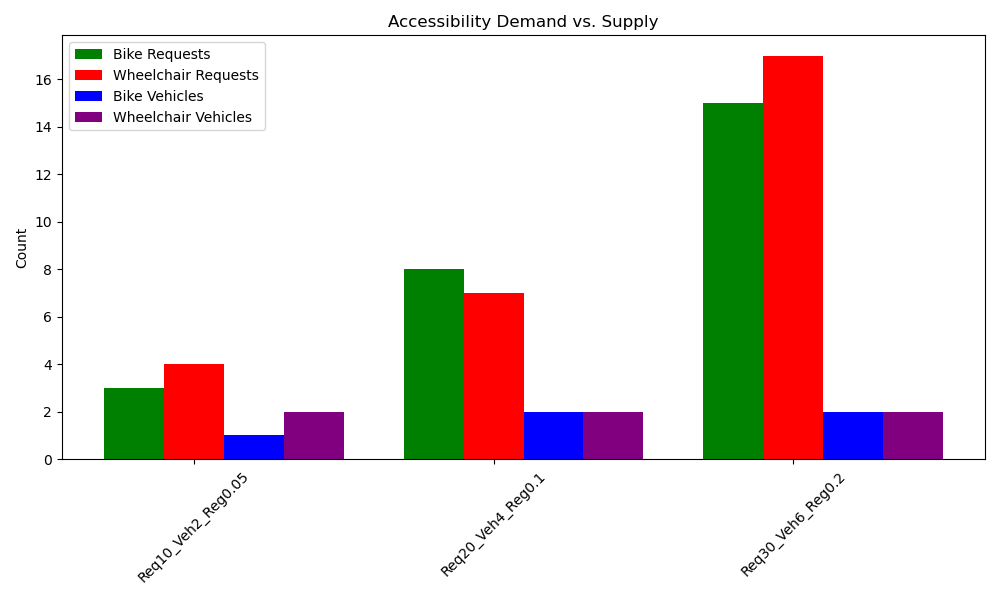

Dial-a-Ride (DAR) Routing with OR-Tools
=======================================

This project demonstrates a **dial-a-ride** or **on-demand** transit algorithm using OR-Tools from Google. It features:

-   **Wide Time Windows** to avoid infeasibility
-   **No Request Skipping** (all requests must be served)
-   **Accessibility Requirements** (bike/wheelchair) for both vehicles and passengers
-   **Multiple Vehicle** support, with the option to use one or many vehicles

The code generates test scenarios, solves the routing problem, produces charts and tables for analysis, and saves interactive maps in HTML.

* * * * *

1\. How the Algorithm Works
---------------------------

1.  **Data Generation**

    -   We create a set of requests (each request has a pickup location, dropoff location, time window, and potential accessibility needs like "needs_bike" or "needs_wheelchair").
    -   We also create multiple vehicles, each with capacity and random capabilities (bike-capable, wheelchair-accessible).
2.  **Routing Model (OR-Tools)**

    -   We use a **RoutingIndexManager** and **RoutingModel** to set up the problem.
    -   **Pickup-and-Delivery** constraints ensure that each request's pickup happens before its dropoff on the same vehicle.
    -   **Time Windows** ensure the pickup and dropoff happen within the allowed time range (though we made these windows wide to reduce infeasibility).
    -   **Capacity Constraints** ensure vehicles do not exceed their passenger limit.
    -   **Accessibility Constraints** ensure a passenger needing a bike/wheelchair can only be assigned to a vehicle that supports that feature.
3.  **Search Parameters**

    -   **First-Solution Strategy**: PATH_CHEAPEST_ARC
    -   **Local-Search Metaheuristic**: GUIDED_LOCAL_SEARCH
    -   **Time Limit**: 30 seconds (configurable)
4.  **Solution Extraction**

    -   OR-Tools returns a solution specifying the route for each vehicle.
    -   We calculate the total distance and approximate simulation time (assuming 30 mph average).

* * * * *

2\. Test Scenarios & Results
----------------------------

We tested **three scenarios** (see `TEST_CONFIGS` in code):

1.  **Req20_Veh4_Reg0.1**
    -   20 requests
    -   4 vehicles
    -   Region size: ±0.1°
2.  **Req30_Veh6_Reg0.2**
    -   30 requests
    -   6 vehicles
    -   Region size: ±0.2°
3.  **Req10_Veh2_Reg0.05**
    -   10 requests
    -   2 vehicles
    -   Region size: ±0.05°

### 2.1 High-Level Results

Below is the raw table of results (distance in miles, sim_time in minutes):

| Config | NumRequests | NumVehicles | RegionSize | distance_miles | sim_time_min |
| --- | --- | --- | --- | --- | --- |
| Req20_Veh4_Reg0.1 | 20 | 4 | 0.10 | 73.376 | 146.752 |
| Req30_Veh6_Reg0.2 | 30 | 6 | 0.20 | 194.668 | 389.336 |
| Req10_Veh2_Reg0.05 | 10 | 2 | 0.05 | 26.601 | 53.202 |

-   **Total Distance**: For each scenario, we sum the route distances for all vehicles.
-   **Simulation Time**: We assume 30 mph average speed, so `distance_miles / 30 * 60`.

### 2.2 Basic Charts

**Total Distance vs. Scenario** (left) and **Simulation Time vs. Scenario** (right):

-   The scenario with 30 requests and region size 0.2 has the highest distance/time (as expected).
-   The smallest scenario (10 requests, 2 vehicles, region size 0.05) is the most compact.

### 2.3 Additional Analysis

The code also generates extra charts for deeper insights:

1.  **Distance per Vehicle**
2.  **Stops per Vehicle**
3.  **Accessibility Demand vs. Supply**
4.  **Distribution of Route Segment Distances**
5.  **Load Over Route Order** (passenger count at each step)

For example:

-   **Load Over Route Order**\
    

-   **Distribution of Route Segment Distances**\
    

-   **Accessibility Demand vs. Supply**\
    

These charts let us see how balanced the routes are, how far each vehicle travels, and whether the algorithm has enough bike/wheelchair-capable vehicles to meet demand.

* * * * *

3\. Map Visualization
---------------------

The solution also generates interactive Folium maps (HTML files) showing each vehicle's route.

-   **Always-Visible Labels**: We use `DivIcon` to show each stop's info without hovering.
-   **Bike/Wheelchair** icons: We add "🚲" or "♿" for pickups that need them.

**Example**:

`<!-- routes_Req20_Veh4_Reg0.1_20250321_100928.html -->`

### Embedding Maps with IFrames

If you want to embed these map files directly in your README (or an HTML report), you can do something like:

`<h2>Routes for Req20_Veh4_Reg0.1</h2>
<iframe src="Maps/routes_Req20_Veh4_Reg0.1_20250321_100928.html"
        width="1000" height="600">
</iframe>`

Adjust the filename, width, and height as needed. In GitHub's Markdown, iframes are often **not** allowed in `.md` files, but you can do this in an HTML file or a Jupyter notebook.

4\. How to Run
--------------

1.  **Install Dependencies**

    -   `pip install ortools folium osmnx networkx haversine matplotlib pandas`
2.  **Run in a Jupyter Notebook**

    -   Just open the `.ipynb` file (or paste the code) and run the cells.
    -   The code automatically displays the maps inline if `IN_JUPYTER` is true.
3.  **Run as a Python Script**

    -   `python main.py`
    -   This will generate the maps as `.html` files, a `results.html` page, and a series of PNG charts.

* * * * *

5\. Future Improvements
-----------------------

-   **Vehicle Usage Cost**: If we want to encourage using multiple vehicles, add a fixed cost per vehicle so the solver chooses more vehicles if it shortens overall routes.
-   **Time Window Slack**: We could measure how close pickups/dropoffs are to their time-window boundaries.
-   **Realistic Speeds/Delays**: We might factor in slower speeds or random traffic delays.
-   **Skipping with Penalties**: If we want partial coverage, reintroduce "skippable" requests with a penalty.

* * * * *

6\. License & Contact
---------------------

-   **License**: [MIT] or your preferred license
-   **Author**: You
-   **Contact**: Email or GitHub link

Feel free to reach out with any questions or suggestions!