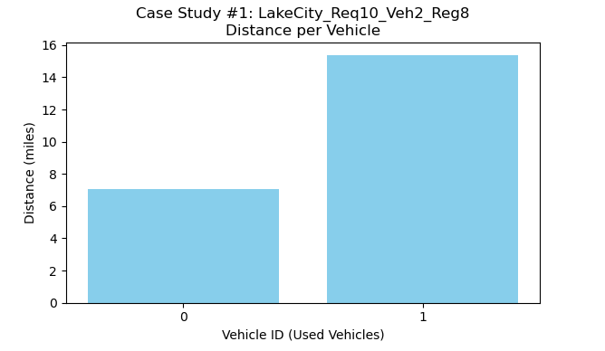

# GoEverywhere Rural Transportation Application
=============================================

Overview
--------

The GoEverywhere application is a dial-a-ride (DAR) solution aimed at improving rural transportation by optimizing ride routes using Google OR-Tools and real-world road network data from OpenStreetMap via the OSMnx library. Our project analyzes system performance using specific case studies based on **Lake City, Florida, USA**, varying the number of ride requests, available vehicles, and geographic region size. This approach enables us to research how the system scales and how accessibility constraints (bike and wheelchair requirements) affect route planning and vehicle utilization using actual road network distances and travel times.

### Case Study Descriptions

These case studies were run using the road network for Lake City, Florida, USA:

-   **Case Study A (Small Region):**
    -   **Configuration:** 10 requests, 2 vehicles, region size ≈ ±0.04° (0.08° diameter bbox)
    -   **Focus:** Examine performance with a low number of requests over a small geographic area.

-   **Case Study B (Moderate Region):**
    -   **Configuration:** 20 requests, 4 vehicles, region size ≈ ±0.075° (0.15° diameter bbox)
    -   **Focus:** Understand system behavior under typical conditions with increased demand and area.

-   **Case Study C (Large Region):**
    -   **Configuration:** 30 requests, 6 vehicles, region size ≈ ±0.125° (0.25° diameter bbox)
    -   **Focus:** Stress test the algorithm with high demand and a larger geographic spread.

For each scenario, the application randomly selected pickup/dropoff locations from actual road network nodes within the defined region. Accessibility requirements (bike/wheelchair) were randomly assigned to requests, and vehicles were randomly designated as bike- and/or wheelchair-accessible during the simulation run.

Analysis of Results
-------------------

Our analysis uses real road network data from Lake City, FL, and includes several key metrics and visualizations for each case study.

### Overall Performance Trend

The following chart compares the total calculated road network distance and the total estimated travel time across the three scenarios.


*   **Interpretation:** As expected, the total distance traveled and the total simulation time increase significantly as the number of requests and the size of the service region grow. This reflects the increasing complexity of serving more passengers over larger areas using the actual road network.

### Case Study A: Small Region (10 Requests, 2 Vehicles, ±0.04° Region)


*   **Map Interpretation:** The map shows two distinct routes (red and blue), indicating that both available vehicles were utilized to serve the 10 requests within the smaller Lake City region. Routes appear relatively contained.




*   **Distance/Stops Charts Interpretation:** The workload (distance and number of stops) is distributed between the two vehicles, although not perfectly evenly, with Vehicle 1 handling a larger share of the distance and stops.


*   **Accessibility Chart Interpretation:** There was a high demand for bike-accessible trips (7 requests) compared to only 1 available bike-capable vehicle. Similarly, 4 wheelchair requests were made with only 1 wheelchair-accessible vehicle available. This mismatch (demand > supply) led to warnings during the solution process (`Warning: No suitable vehicle found...`) and indicates potential bottlenecks or unserved requests if constraints were strictly enforced without penalties or alternative assignments.


*   **Segment Distance Chart Interpretation:** Most individual trips between stops (segments) are short (under 1 mile), typical for intra-city travel. There's a small number of longer segments (up to 2.5 miles), reflecting travel across the defined region.


*   **Vehicle Load Chart Interpretation:** The chart shows the passenger load for both vehicles over their routes. Loads peak at relatively low levels (max 2 for Vehicle 0, max 5 for Vehicle 1), well below the high vehicle capacity setting, indicating capacity was not a constraint here.

*   **Case A Summary:** In the small scenario, the system effectively utilized both available vehicles to distribute the workload. However, significant accessibility constraints were present, highlighting the importance of matching vehicle capabilities to rider needs.

### Case Study B: Moderate Region (20 Requests, 4 Vehicles, ±0.075° Region)


*   **Map Interpretation:** Strikingly, the map shows **only one route** (red) serving all 20 requests, despite 4 vehicles being available. The route is considerably longer and more spread out than in Case A, covering the larger region. The console output confirms that vehicles 0, 1, and 3 were *not used*.


*   **Distance/Stops Charts Interpretation:** These charts show only one bar each (for Vehicle 2, based on console logs), confirming that a single vehicle handled the entire workload (all 20 requests / 40 stops). This indicates highly inefficient utilization of the available fleet.


*   **Accessibility Chart Interpretation:** The mismatch between accessibility demand and supply is even more pronounced here (e.g., 10 bike requests vs. 2 capable vehicles, 9 wheelchair requests vs. 4 capable vehicles). This severe constraint likely forced the solver to rely heavily on the single vehicle that *could* potentially serve the most requests, even if inefficiently from a distance/time perspective for the overall system.


*   **Segment Distance Chart Interpretation:** The distribution remains skewed towards shorter segments, but the presence of segments up to 3.5 miles reflects the larger service area.


*   **Vehicle Load Chart Interpretation:** The chart shows the load profile for the single utilized vehicle. The passenger load reaches much higher peaks (up to 10 passengers) compared to Case A, as this vehicle is responsible for all pickups and dropoffs.

*   **Case B Summary:** Despite having more vehicles available, the severe accessibility constraints likely led the solver to find an optimal (or perhaps the *only feasible solution within the time limit*) using only one vehicle. This highlights a critical failure mode where fleet resources are underutilized due to specialized demand significantly exceeding the supply of appropriately equipped vehicles.

### Case Study C: Large Region (30 Requests, 6 Vehicles, ±0.125° Region)


*   **Map Interpretation:** Similar to Case B, **only one vehicle route** (red) is shown, serving all 30 requests across the largest geographic area. This occurs despite 6 vehicles being theoretically available. The route is extensive and complex. Console logs confirm vehicles 0-4 were unused.


*   **Distance/Stops Charts Interpretation:** Again, single bars confirm that only one vehicle (Vehicle 5, based on console logs) performed all 30 pickups and 30 dropoffs. Fleet utilization remains extremely low.


*   **Accessibility Chart Interpretation:** The accessibility demand remains very high (14 bike, 12 wheelchair) compared to the available capable vehicles (4 bike, 2 wheelchair). This persistent bottleneck likely dictates the single-vehicle solution.


*   **Segment Distance Chart Interpretation:** The pattern is similar to Case B, with predominantly short segments but a tail extending due to the large region.


*   **Vehicle Load Chart Interpretation:** The single vehicle's load reaches very high levels (peaking around 17 passengers), indicating it is heavily utilized while the rest of the fleet sits idle.

*   **Case C Summary:** The trend observed in Case B is confirmed and exacerbated. Even with more vehicles and requests over a larger area, the accessibility constraints appear to be the dominant factor, forcing a suboptimal, single-vehicle solution. The system fails to leverage the additional fleet resources effectively under these conditions.

How to Reproduce
----------------

To reproduce these results using the provided Jupyter notebook:

1.  **Install Anaconda Navigator:**\
    If you haven't already, download and install Anaconda Navigator.

2.  **Open Anaconda Navigator and Launch JupyterLab:**
    -   Open Anaconda Navigator.
    -   Click the "Launch" button under **JupyterLab**.

3.  **Open the Notebook:**
    -   In JupyterLab, navigate to the folder containing the file **`DARP_LATEST.ipynb`** (or your current notebook filename).
    -   Click to open the notebook.

4.  **Install Required Libraries:**\
    Ensure you have the following Python packages installed. You can install them via Anaconda Prompt or within a Jupyter cell:

    ```bash
    pip install ortools folium osmnx networkx pandas matplotlib numpy
    ```
    *(Note: `haversine` is no longer required for the core logic but might be listed if you kept the import).*

5.  **Run All Cells:**
    -   In JupyterLab, select **Run > Run All Cells** (or press Ctrl+A then Shift+Enter).
    -   The notebook will download map data (if not cached), run the three case studies, compute optimized routes using the road network, generate the analysis charts, and save interactive Folium maps (HTML files). **Ensure the `images/` subfolder exists or is created before running if saving plots directly from code is intended.**

6.  **Review the Output:**
    -   The notebook will print summary metrics for each scenario.
    -   The charts (like those referenced above) will be displayed inline. Save these charts to the `images/` folder with the specified naming convention (e.g., `case_study_A_distance_per_vehicle.png`).
    -   An HTML results page (`results_real_addresses.html`) will be generated, summarizing key metrics and providing links to the interactive route maps (HTML files).

Conclusion
----------

This project successfully demonstrates the implementation of a dial-a-ride optimization system using real-world road network data for Lake City, FL. The analysis across three case studies reveals:

-   The system correctly calculates routes based on actual road distances and scales predictably in terms of total distance/time as demand and region size increase.
-   **Critical Finding:** Accessibility constraints heavily influence vehicle utilization. When the demand for specialized vehicles (bike/wheelchair capable) significantly exceeds the number of available, appropriately equipped vehicles, the solver may resort to using only one (or very few) vehicles to serve all requests. This leads to poor overall fleet utilization and potentially long routes for the single active vehicle, even when other non-specialized vehicles are idle.
-   This highlights the crucial importance of **fleet composition** in relation to expected rider needs. Simply adding more vehicles may not improve service if they lack the required accessibility features.
-   Future work could explore strategies to handle scenarios with insufficient specialized vehicles, such as implementing penalties for unmet requests, allowing transfers, or adjusting solver parameters to encourage the use of more vehicles even if individual routes become slightly less optimal for the single vehicle.

By following the reproduction steps, users can run these simulations and further explore the impact of different parameters on rural DAR optimization.